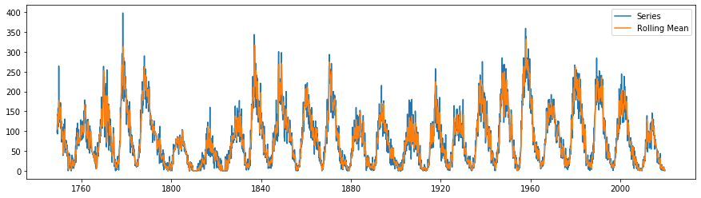
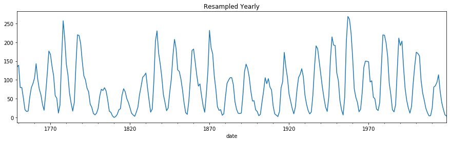

# Manipulate Time Data


**This morning** we will practice loading in and manipulating time series data.

In the cell below we import a dataset that counts the number of monthly [sunspots](https://en.wikipedia.org/wiki/Sunspot#:~:text=Sunspots%20are%20temporary%20phenomena%20on,pairs%20of%20opposite%20magnetic%20polarity.) from 1749-2019


```python
import pandas as pd
import matplotlib.pyplot as plt
from test_scripts.test_class import Test
test = Test()

df = pd.read_csv('data/Sunspots.csv')
df = df.iloc[:,1:]
df.columns  = ['date', 'sunspots']
df.head()
```


```python
# __SOLUTION__
import pandas as pd
import matplotlib.pyplot as plt
from test_scripts.test_class import Test
test = Test()

df = pd.read_csv('data/Sunspots.csv')
df = df.iloc[:,1:]
df.columns  = ['date', 'sunspots']
df.head()
```


<div>
<style scoped>
    .dataframe tbody tr th:only-of-type {
        vertical-align: middle;
    }

    .dataframe tbody tr th {
        vertical-align: top;
    }

    .dataframe thead th {
        text-align: right;
    }
</style>
<table border="1" class="dataframe">
  <thead>
    <tr style="text-align: right;">
      <th></th>
      <th>date</th>
      <th>sunspots</th>
    </tr>
  </thead>
  <tbody>
    <tr>
      <th>0</th>
      <td>1749-01-31</td>
      <td>96.7</td>
    </tr>
    <tr>
      <th>1</th>
      <td>1749-02-28</td>
      <td>104.3</td>
    </tr>
    <tr>
      <th>2</th>
      <td>1749-03-31</td>
      <td>116.7</td>
    </tr>
    <tr>
      <th>3</th>
      <td>1749-04-30</td>
      <td>92.8</td>
    </tr>
    <tr>
      <th>4</th>
      <td>1749-05-31</td>
      <td>141.7</td>
    </tr>
  </tbody>
</table>
</div>


Let's check the datatype for the `date` column.


```python
df.date.dtype
```


```python
# __SOLUTION__
df.date.dtype
```


    dtype('O')


Currently, the `date` column is an `Object` datatype which is the datatype pandas used for strings.

<u><b>In the cell below:</b></u>
1. Change the datatype of the `date` column to `datetime`.
2. Set the `date` column as the index for the `df` variable.


```python
# Your code here

```


```python
# __SOLUTION__

df['date'] = pd.to_datetime(df.date)

df.set_index('date', inplace = True)

df.head()
```


<div>
<style scoped>
    .dataframe tbody tr th:only-of-type {
        vertical-align: middle;
    }

    .dataframe tbody tr th {
        vertical-align: top;
    }

    .dataframe thead th {
        text-align: right;
    }
</style>
<table border="1" class="dataframe">
  <thead>
    <tr style="text-align: right;">
      <th></th>
      <th>sunspots</th>
    </tr>
    <tr>
      <th>date</th>
      <th></th>
    </tr>
  </thead>
  <tbody>
    <tr>
      <th>1749-01-31</th>
      <td>96.7</td>
    </tr>
    <tr>
      <th>1749-02-28</th>
      <td>104.3</td>
    </tr>
    <tr>
      <th>1749-03-31</th>
      <td>116.7</td>
    </tr>
    <tr>
      <th>1749-04-30</th>
      <td>92.8</td>
    </tr>
    <tr>
      <th>1749-05-31</th>
      <td>141.7</td>
    </tr>
  </tbody>
</table>
</div>


Run the cell below to test your results!


```python
test.run_test(df, 'sunspot_date_index')
```


```python
# __SOLUTION__
test.run_test(df, 'sunspot_date_index')
```


✅ **Hey, you did it.  Good job.**


Ok, let's take a look at the sunspots data.

<u><b>In the cell below</b></u>, plot a simple line plot of the sunspots column, using the datetime index as the x-axis


```python
df.sunspots.plot(figsize=(15,4));
```


```python
# __SOLUTION__
df.sunspots.plot(figsize=(15,4));
```


Please describe the data. Do you see any trends or Seasonality?


```python
# Your answer here

```


```python
# __SOLUTION__
print('''
There is a repeating pattern in these data that 
repeats about every 10 years, and serves as evidence of seasonality. 
There is some evidence of a repeating cycle every 100 years as well,
but this pattern is much more subtle than the 10 year seasonality.''')
```

    
    There is a repeating pattern in these data that 
    repeats about every 10 years, and serves as evidence of seasonality. 
    There is some evidence of a repeating cycle every 100 years as well,
    but this pattern is much more subtle than the 10 year seasonality.


**Let's find the rolling mean with a window of 3 time steps**


```python
# Find the rolling mean with the .rolling method
rolling_mean = df.sunspots.rolling(window=3).mean()

# Plot the rolling mean and the original data together
plt.figure(figsize=(15,4))
plt.plot(df.index, df.sunspots, label='Series')
plt.plot(df.index, rolling_mean, label='Rolling Mean')
plt.legend();
```


```python
# __SOLUTION__
# Find the rolling mean with the .rolling method
rolling_mean = df.sunspots.rolling(window=3).mean()

# Plot the rolling mean and the original data together
plt.figure(figsize=(15,4))
plt.plot(df.index, df.sunspots, label='Series')
plt.plot(df.index, rolling_mean, label='Rolling Mean')
plt.legend();
```





**Ok Ok,** Let's define a function called `rolling_mean_diff` that, when given a series and a window size:
1. Will find the rolling mean with the provided window size
2. Subtract the rolling mean from the original series. 
3. Return the differenced time series


```python
# Your code here
```


```python
# __SOLUTION__
def rolling_mean_diff(series, window=3):
    rolling_mean = series.rolling(window=3).mean()
    return series - rolling_mean
```

Now,  let's use our `rolling_mean_diff` function to see if subtracting the rolling mean results in a stationary time series.


```python
sunspots_rolling_mean_diff = rolling_mean_diff(df.sunspots)
```


```python
# __SOLUTION__
sunspots_rolling_mean_diff = rolling_mean_diff(df.sunspots)
```

Run the cell below to test your results!


```python
test.run_test(sunspots_rolling_mean_diff, 'sunspots_rolling_mean_diff')
```


```python
# __SOLUTION__
test.run_test(sunspots_rolling_mean_diff, 'sunspots_rolling_mean_diff')
```


✅ **Hey, you did it.  Good job.**


Now, let's plot the newly differenced time series.


```python
sunspots_rolling_mean_diff.plot(figsize=(15,4));
```


```python
# __SOLUTION__
sunspots_rolling_mean_diff.plot(figsize=(15,4));
```


Please interpret the graph above. Is it stationary?


```python
# Your answer here

```


```python
# __SOLUTION__
print('''
After differencing using a rolling mean, with a window of 3 time steps,
the time series is much more stationary than in its original form.
There is still a slight seasonality within these data that could
perhaps be modeled further.''')
```

    
    After differencing using a rolling mean, with a window of 3 time steps,
    the time series is much more stationary than in its original form.
    There is still a slight seasonality within these data that could
    perhaps be modeled further.


## Resample

Lastly, let's resample our data.

We will down sample our data to a `calendar year end` [yearly frequency](https://pandas.pydata.org/pandas-docs/stable/user_guide/timeseries.html#dateoffset-objects).


```python
# Your code here
yearly = None
```


```python
# __SOLUTION__
yearly = df.sunspots.resample('A').mean()
```

Run the cell below to test your results!


```python
test.run_test(yearly, 'yearly_resample')
```


```python
# __SOLUTION__
test.run_test(yearly, 'yearly_resample')
```


✅ **Hey, you did it.  Good job.**


Let's take a look at our yearly time series.


```python
yearly.plot(figsize=(15,4), title='Resampled Yearly');
```


```python
# __SOLUTION__
yearly.plot(figsize=(15,4), title='Resampled Yearly');
```




